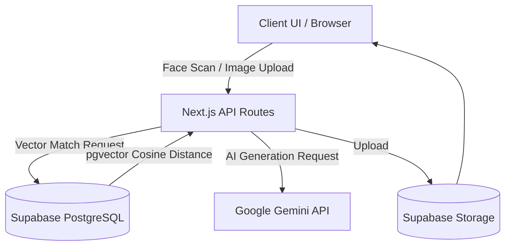

# Pranjal's Memory Universe


A highly secure, biometric-locked personal archiving system and interactive 3D universe. This application goes beyond standard photo galleries by using true 128-Dimensional facial vector embeddings to authenticate the administrator and protect private memories, alongside advanced AI-driven features like semantic relationship puzzles and generative studios.

---

## Architecture Overview

The system is built on a modern Next.js 14 stack, leveraging React Server Components and edge middleware for strict security isolation.



## Key Features

### Military-Grade Biometric Security
- **128-D Vector Verification**: Uses face-api.js to compute exact facial Euclidean vectors. The backend compares these vectors against a known administrative template using pgvector.
- **Edge Route Protection**: Employs Next.js edge middleware to strictly wall off all admin-level routes (`/gallery`, `/timeline`, `/collections`, etc.). 
- **Guest Isolation Portal**: Non-admin users who scan their face are mathematically restricted at the database level to only view photos they are explicitly tagged in.

### Interactive 3D Frontend
- **Three.js Particle Universe**: Built with `@react-three/fiber` and `@react-three/drei` to render a lightweight, highly optimized floating 3D particle network representing your memory neural graph.
- **Glassmorphic UI**: Clean, modern aesthetics layered over the 3D canvas, featuring Lucide React iconography and Tailwind CSS animations.

### Advanced AI Capabilities
- **Semantic Puzzles Engine**: Automatically generates dynamic puzzles using true Haversine distance calculations and Gemini AI semantic clustering on EXIF metadata.
- **Creative Studio**: An integrated AI canvas allowing generative interaction with the secure archive.
- **Auto-Tagging System**: High-speed facial detection runs on every upload. If a known vector is recognized, the person is automatically tagged. Unrecognized faces remain unassigned to prevent database clutter, awaiting manual tagging via the custom React autocomplete menu.

---

## Data Flow & Authentication

1. **Capture**: The user's webcam feed is processed via `face-api.js`.
2. **Extraction**: A 128-float array (vector embedding) is extracted from the face.
3. **Transmission**: The embedding is sent to `/api/auth/face`.
4. **Matching**: A PostgreSQL RPC (`match_faces`) uses pgvector's cosine distance `<=>` operator to find the closest match.
5. **Thresholding**: If the match exceeds the strict Administrator threshold (0.92), a full-access HttpOnly token is issued. If it exceeds the Guest threshold (0.75), an isolated Guest token is issued.

---

## Technology Stack

- **Framework**: Next.js 14 (App Router, Server Actions)
- **Language**: TypeScript
- **Styling**: Tailwind CSS
- **3D Rendering**: Three.js / React Three Fiber
- **Database & Storage**: Supabase (PostgreSQL + pgvector)
- **Biometrics**: face-api.js (TensorFlow.js)
- **AI Processing**: Google Gemini API
- **Maps**: Mapbox GL / react-map-gl

---

## Getting Started

### Prerequisites
- Node.js (v18 or higher)
- Supabase Account & Database with pgvector extension enabled
- Google Gemini API Key

### Installation

1. **Clone the repository:**
   ```bash
   git clone https://github.com/sailwalpranjal/pranjals-memory-universe.git
   cd pranjals-memory-universe
   ```

2. **Install dependencies:**
   ```bash
   npm install
   ```

3. **Set up Environment Variables:**
   Rename `.env.example` to `.env.local` and fill in your keys:
   ```env
   NEXT_PUBLIC_SUPABASE_URL=your_supabase_url
   SUPABASE_SERVICE_ROLE_KEY=your_supabase_service_key
   GEMINI_API_KEY=your_gemini_api_key
   NEXT_PUBLIC_MAPBOX_TOKEN=your_mapbox_token
   ```

4. **Initialize Database:**
   Run the setup script to initialize the PostgreSQL tables, indexes, and RPC functions:
   ```bash
   node setup-db.js
   ```

5. **Train the Biometric Admin (First Time Setup):**
   Navigate to the `/settings` tab (after bypassing via the fallback authentication) and use the built-in Biometric Security Engine panel to train the administrator face.

6. **Run the Development Server:**
   ```bash
   npm run dev
   ```
   Navigate to `http://localhost:3000`.

---

## Deployment (Vercel)

This project is optimized for deployment on Vercel.

1. Push your code to your GitHub repository.
2. Go to your Vercel Dashboard and click **Add New... > Project**.
3. Import this GitHub repository.
4. Add all the environment variables from your `.env.local` file into the Vercel project settings.
5. In the Build & Development Settings, Vercel will automatically detect Next.js. Leave the build command as `npm run build`.
6. Click **Deploy**.

> **Note on Deployment Dependencies**: 
> The project uses canvas as a backend server component for face-api processing. It is explicitly marked in `next.config.mjs` under `serverComponentsExternalPackages` to guarantee Vercel's Node.js edge functions compile it flawlessly.

---

## Privacy & Security Note

This application processes highly sensitive biometric data. The `face-api.js` calculations occur securely, and raw 128-D vector arrays are securely hashed in the Supabase database. Vector comparisons never expose the underlying logic to the client.

## License

This project is licensed under the MIT License.
