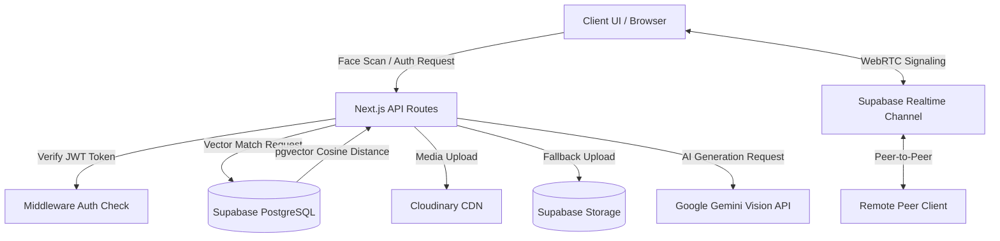
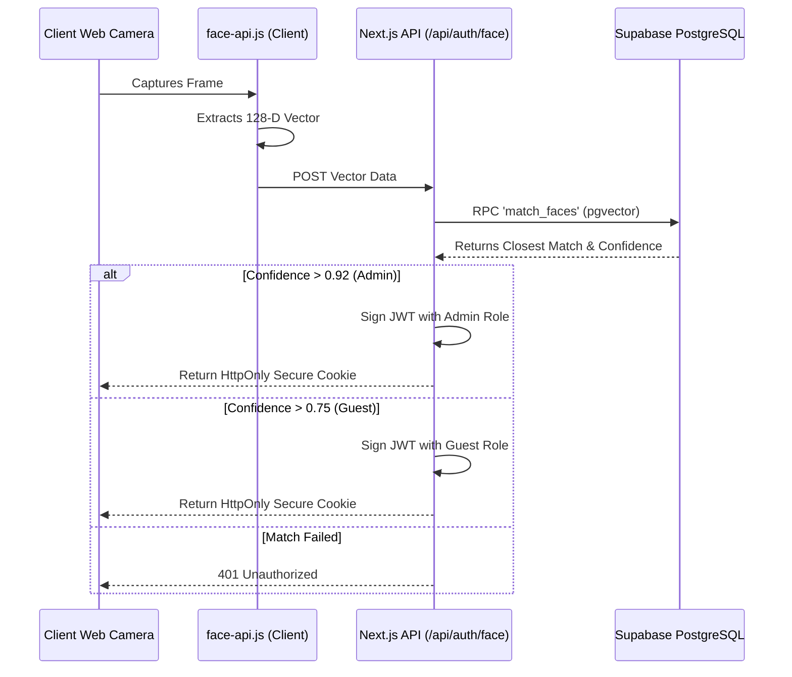
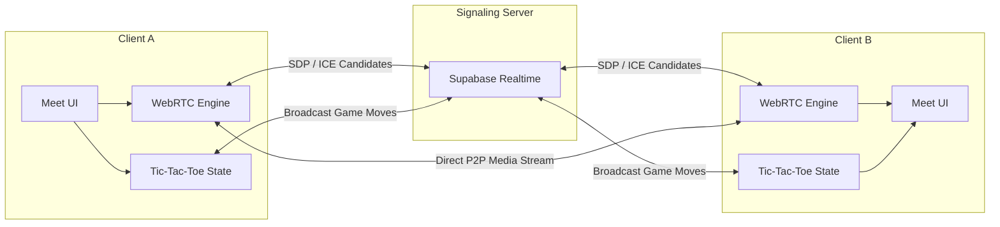
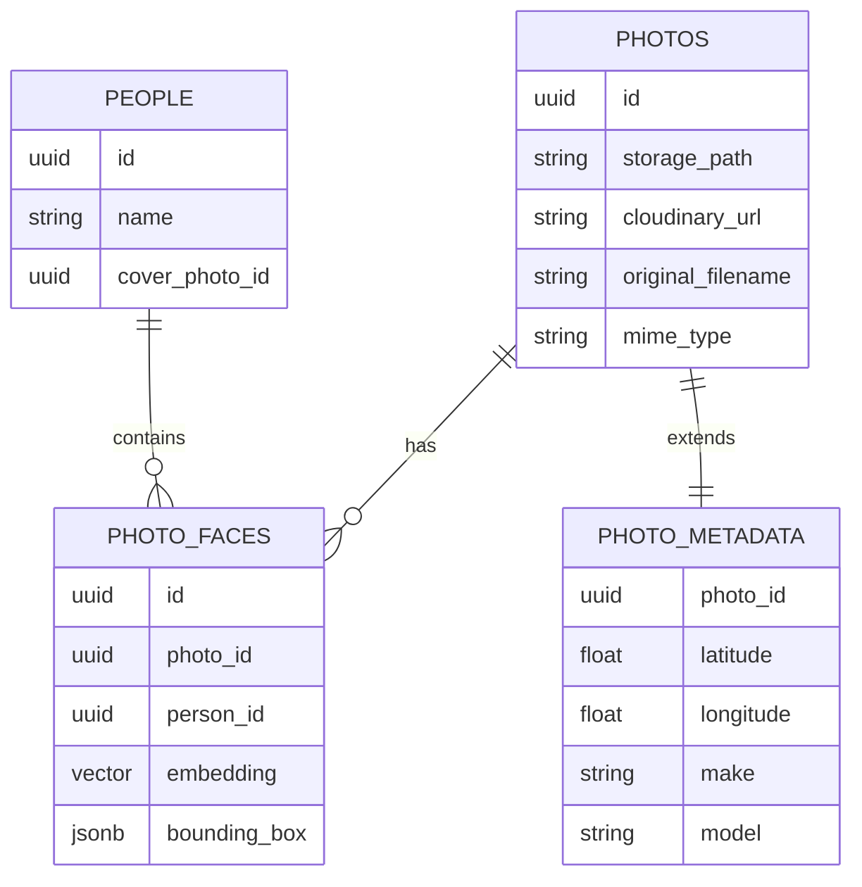

# Pranjal's Memory Universe


I built this application as a highly secure, biometric-locked personal archiving system and interactive 3D universe. My objective was to move beyond standard photo galleries and architect a system that treats memories as interconnected nodes of data, protected by enterprise-grade patterns. 

This project uses 128-Dimensional facial vector embeddings to authenticate the administrator and protect private memories. It also features advanced AI-driven semantic relationship puzzles, real-time WebRTC communication, and dynamic generative studios. It serves as both a secure vault for my personal data and a technical sandbox for experimenting with leading-edge web technologies.

---

## Architecture Overview

The system is built on a modern Next.js 15 stack, leveraging React 19 Server Components, Edge Middleware for strict security isolation, and a hybrid storage approach.



## Core Engineering Implementations

### Cryptographic JWT Authentication & Biometric Security
Security is a core focus of this application. Instead of relying on plaintext cookies or session IDs, the system generates secure JSON Web Tokens (JWTs) using the HS256 algorithm via the jose library.

- **128-D Vector Verification:** The frontend processes webcam feeds via face-api.js to compute exact facial Euclidean vectors. These embeddings are matched against administrative templates in PostgreSQL using the pgvector extension (Cosine Distance operator).
- **Edge Route Protection:** Next.js Edge Middleware intercepts all requests to protected routes (e.g., /timeline, /meet, /puzzles, /api/upload). It cryptographically verifies the JWT before allowing the request to proceed, ensuring strict walling of administrative capabilities.

### Data Flow: Face Authentication

The sequence below illustrates how biometric data is processed entirely in memory without compromising security.



### Intelligent Asset Pipeline (Cloudinary & Supabase)
Handling rich media efficiently required a robust pipeline. I designed a hybrid system to ensure zero downtime and rapid delivery:

- Primary uploads are routed to **Cloudinary**, utilizing their optimized CDN for automatic formatting, resizing, and fast global delivery.
- A seamless fallback mechanism routes uploads to **Supabase Storage** if the CDN integration is unavailable or unconfigured.
- For private assets stored in Supabase, the backend dynamically generates temporary Signed URLs to prevent direct public access to the raw files.
- Vercel's serverless 4.5MB payload limit is actively monitored on the client side, intercepting large video uploads gracefully.

### WebRTC & Real-Time Synchronized Multiplayer
The application includes a Meet feature that goes beyond standard video conferencing, integrating synchronous gameplay.

- **Peer-to-Peer Communication:** Implemented custom WebRTC hooks handling ICE candidates, session descriptions (SDP), and media streams for ultra-low latency video and audio transmission.
- **Supabase Realtime Signaling:** Utilizes Supabase Realtime WebSocket channels for high-speed signaling between peers. I implemented a strict message queuing wrapper to hold broadcasts until the WebSocket connection achieves a fully joined state, preventing packet loss during initial handshakes.
- **Synchronous Gameplay:** Integrated multiplayer games (like Tic-Tac-Toe) directly into the video call interface. Game states are broadcasted over the established data channels, allowing participants to play synchronously while maintaining the video feed.



### Advanced AI Capabilities
- **Semantic Generation:** Uses Google Gemini 2.5 Flash API to automatically extract contextual metadata, suggested tags, and narrative descriptions from uploaded images.
- **Contextual Puzzles Engine:** An AI-driven system that aggregates random photos from the database and uses Gemini to dynamically generate semantic connections, presenting them as challenging visual puzzles. A strict timeout controller ensures the application never hangs if the AI provider latency spikes.

### Lab Telemetry & Interactive 3D Frontend
- **Live System Telemetry:** The Lab interface simulates a real-time developer operations console, featuring a Live Neural Heatmap and mocked metrics (CPU Load, Memory Usage) that update continuously, showcasing advanced state management in React.
- **Three.js Particle Universe:** The landing page renders a highly optimized, interactive 3D particle network representing a neural memory graph, utilizing `@react-three/fiber` and `@react-three/drei`.

---

## Database Entity Relationship

The PostgreSQL schema relies on relational integrity and vector extensions to construct the memory graph.



---

## Technology Stack

- **Framework:** Next.js 15 (App Router, Server Actions)
- **Language:** TypeScript
- **UI & Styling:** Tailwind CSS, Lucide Icons, Glassmorphic Design Patterns
- **3D Rendering:** Three.js, React Three Fiber
- **Database:** Supabase (PostgreSQL + pgvector)
- **Authentication:** Custom JWT (jose), face-api.js (TensorFlow.js)
- **Asset Management:** Cloudinary API, Supabase Storage
- **AI Processing:** Google Gemini SDK
- **Real-time:** WebRTC, Supabase Realtime Channels

---

## Getting Started

### Prerequisites
- Node.js (v18 or higher)
- Supabase Account & Database (with pgvector extension enabled)
- Cloudinary Account (for media optimization)
- Google Gemini API Key

### Installation

1. **Clone the repository:**
   ```bash
   git clone https://github.com/sailwalpranjal/pranjals-memory-universe.git
   cd pranjals-memory-universe
   ```

2. **Install dependencies:**
   This project resolves strict peer dependencies for React 19. Ensure you use the provided `.npmrc` or run:
   ```bash
   npm install --legacy-peer-deps
   ```

3. **Set up Environment Variables:**
   Rename `.env.example` to `.env.local` and populate your API keys:
   ```env
   NEXT_PUBLIC_SUPABASE_URL=
   SUPABASE_SERVICE_ROLE_KEY=
   JWT_SECRET=
   GEMINI_API_KEY=
   CLOUDINARY_URL=
   NEXT_PUBLIC_CLOUDINARY_CLOUD_NAME=
   ```

4. **Initialize Database:**
   Run the setup script to initialize the PostgreSQL tables, vector indexes, and RPC functions:
   ```bash
   node setup-db.js
   ```

5. **Train the Biometric Admin:**
   Access the system using a fallback auth token (if configured) and navigate to the `/settings` tab to train the initial administrative facial vector.

6. **Run the Development Server:**
   ```bash
   npm run dev
   ```
   Navigate to `http://localhost:3000`.

---

## Deployment (Vercel)

This project is optimized for Edge deployment on Vercel.

1. Push your code to your GitHub repository.
2. Import the repository into the Vercel Dashboard.
3. Inject all variables from `.env.local` into the Vercel Environment Variables configuration.
4. Vercel automatically detects Next.js. Retain the default build command (`npm run build`).
5. Deploy.

*Note: The face-api.js processing relies on the canvas module in Node environments. This is explicitly handled via Turbopack aliases and serverExternalPackages in next.config.mjs to guarantee Vercel compilation.*

---

## Privacy & Security Considerations

This application processes highly sensitive biometric data. The face-api.js calculations occur securely on the client or edge, and raw 128-D vector arrays are securely stored in the database. Vector comparisons never expose the underlying logic or raw templates to the client. The system restricts raw asset querying via edge middleware and relies strictly on cryptographic JWTs for session state.

## License

This project is licensed under the MIT License.
